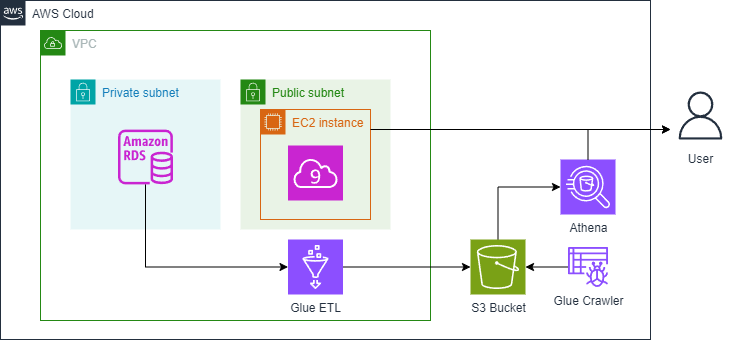
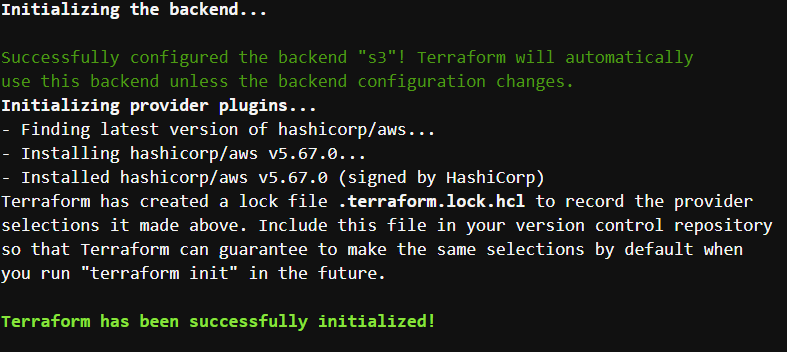
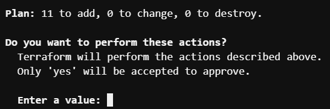
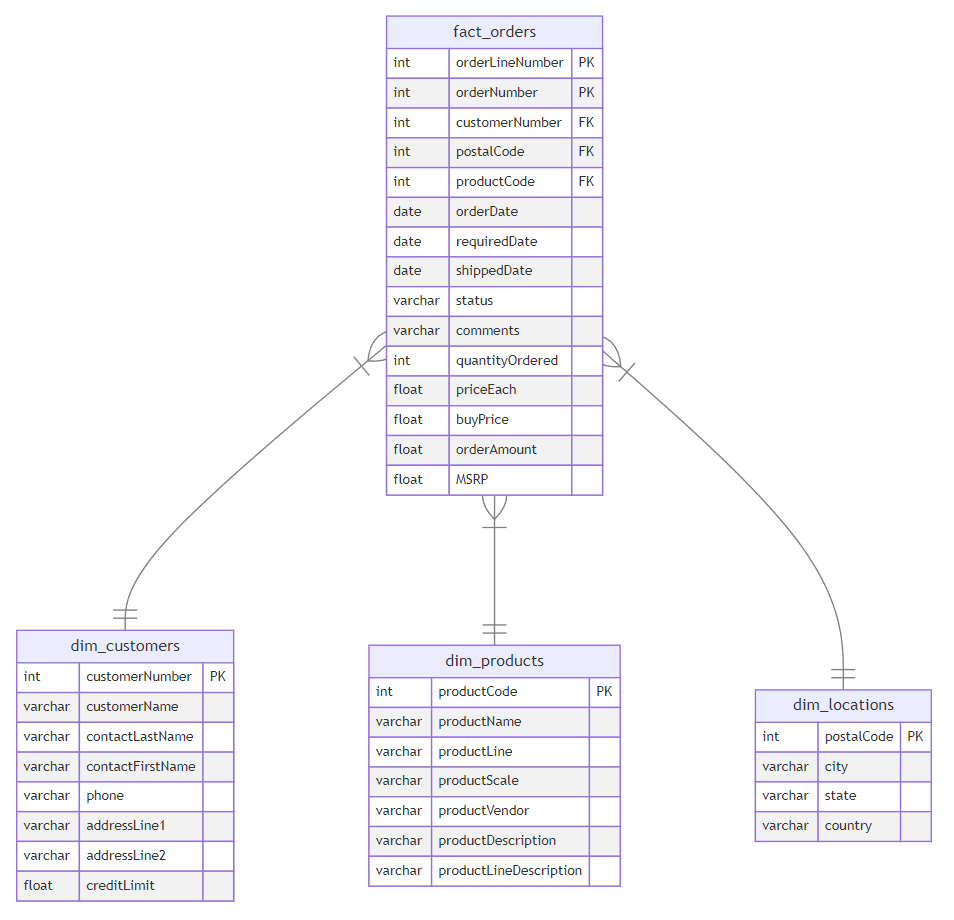

### 1 - Introduction

1. **Context:**
   - As a Data Engineer at a retailer, you're tasked with building a data pipeline for 
        historical purchases and customer information stored in a MySQL database.

2. **Objective:**
   - Build a data pipeline using MySQL on Amazon RDS as the source.
   - Use AWS Glue to extract, transform, and load (ETL) the data into Amazon S3.
   - Query the transformed data using Amazon Athena and visualize it in Jupyter Lab.

3. **Data Structure:**
   - The source relational database contains tables such as `customers`, `products`, 
        `productlines`, `orders`, `orderdetails`, `payments`, `employees`, and `offices`.

4. **Analyst Need:**
   - The marketing analyst wants to analyze historical data, such as product line performance 
        and country-based sales distribution. They need faster, simpler queries.

5. **Your Role:**
   - Design a pipeline to optimize and transform this data for analytics, ensuring high performance and simple query access.

---

### 2 - Exploring the Source System

1. **Source System Overview:**
   - The source system is a MySQL database hosted on Amazon RDS, representing a relational database.

2. **Purpose:**
   - As a Data Engineer, your goal is to explore and extract data from this source system as part of the data pipeline. 

3. **MySQL Database Structure:**
   - The database you will interact with contains pre-populated data, and you will explore it 
        using commands via a terminal session connected to the MySQL instance in AWS.
 
4. Get the endpoint of Amazon RDS MySQL instance

``` bash
aws rds describe-db-instances --db-instance-identifier <MySQL-DB-name> --output text --query "DBInstances[].Endpoint.Address"
```

5. Connect to the database and replace:
- `<MySQLEndpoint>` with the output from the previous step,

- `<DatabaseUserName>` with `admin`,

- `<Password>` with `adminpwrd`:

``` bash
mysql --host=<MySQLEndpoint> --user=<DatabaseUserName> --password=<Password> --port=3306
```

6. Check the database labeled `classicmodels`
``` bash
use classicmodels;
show tables;
``` 
Output examples:


7. Exit
``` bash
exit
```

### 3 - Architecture of the Data Pipeline 

1. **Architecture Overview**:
   - **Source Database**: RDS MySQL instance storing transactional data (OLTP system).

2. **ETL (Extraction, Transformation & Load)**:
   - **Extraction**: Use [AWS Glue](https://aws.amazon.com/en/glue/) to extract data from the RDS database.
   - **Transformation**: Glue transforms data into a star schema, making it more readable and easier for analysis. 
         This includes tasks like denormalization and data cleaning.
   - **Load**: Store transformed data in [Amazon S3](https://aws.amazon.com/en/s3/), 
         using Parquet format for optimized analytical use.

3. **Serving Layer**:
   - **Amazon Athena**: Query service for running SQL-like queries on data stored in 
         S3 without loading it into a traditional database.

4. **Cloud9 Setup**:
   - **EC2 Instance**: Provides a virtual machine to host the Cloud9 IDE, 
         used for development and lab tasks.

### 4 - Extracting, Transforming and Loading Data
1. **Terraform for Infrastructure Setup**:
   - Use [Terraform](https://www.terraform.io/) to define and provision the infrastructure for your data pipeline.
   - Terraform allows you to describe the infrastructure using a declarative configuration language, 
      supporting cloud providers and on-premises infrastructure.

2. **Directory Overview**:
   - Check the contents of the `infrastructure/terraform` directory.
   - This directory contains `tf` files that define the configurations for the 
      data pipeline resources. The files are organized for readability.

3. **AWS Glue Configuration**:
   - The `tf` files set up the infrastructure, but you also need to configure 
      AWS Glue for data extraction, transformation, and loading.
   - Refer to the Python script at [infrastructure/terraform/assets/glue_job.py](infrastructure/terraform/assets/glue_job.py) 
      for Glue job configurations.
 
4. **Navigate to Terraform Directory**:

``` bash
cd infrastructure/terraform
```

5. **Check Configuration Parameters**:
   - The Terraform configuration uses parameters from the database instance.
   - Parameters are defined as environment variables with the prefix `TF_VAR_` in your `~/.bashrc` file.
   - These variables were set up when you executed the `setup.sh` command in your Cloud9 environment.

6. **Initialize Terraform Configuration**:

``` bash
terraform init
```


7. **Generate Terraform Plan**:
   - Preview changes to infrastructure with the command:
     ```bash
     terraform plan
     ```
   - Terraform will analyze configuration files, compare the desired state with the current infrastructure state, and calculate necessary actions.
   - Review the summary of planned changes for resources to be added, modified, or deleted.
   - If the plan fails, ensure input variables were correctly assigned.

8. **Check AWS Glue Console**:
   - Open the AWS console, search for *Glue*, and open *AWS Glue*.
   - Navigate to *ETL jobs* on the left side of the dashboard.
   - Confirm there are no jobs defined yet.

9. **Apply Terraform Configuration**:
   - Apply the configuration with the command:
     ```bash
     terraform apply
     ```
   - Review the plan and respond with `yes` to proceed:
     

10. **Monitor Deployment Progress**:
   - Check the terminal for deployment progress.
   - Terraform will create resources in your AWS account.
   - Upon completion, you will receive a confirmation similar to:
     

11. **Verify AWS Glue Job Creation**:
   - Return to the AWS Glue console and check *ETL jobs*.
   - You should see a job named `de-c1w2-etl-job` created via IaC.
     

12. **Start AWS Glue Job**:
   - Execute the command to start the Glue job and get the `JobRunID`:
     ```bash
     aws glue start-job-run --job-name de-c1w2-etl-job | jq -r '.JobRunId'
     ```

13. **Check Glue Job Status**:
   - Monitor the job status using the `JobRunID`:
     ```bash
     aws glue get-job-run --job-name de-c1w2-etl-job --run-id <JobRunID> --output text --query "JobRun.JobRunState"
     ```
   - Alternatively, check the job status in the Glue console under the `Runs` tab.
   - Wait until the status changes to `SUCCEEDED` (approximately 2-3 minutes).

**Note on Data Transformation**:
   - The Glue job transformed data from the original schema to a star schema:
     
   - The star schema simplifies data analysis by separating measurements (fact table) and contextual information (dimension tables).
   - This structure allows data analysts to perform simpler queries for aggregations and insights.
   - Learn more about data modeling in Course 4 of this specialization.

### 5 - Data Insights and Visualizations

1. **Objective:**
   - Hand over the transformed data in S3 to the data analyst, 
        who will query it using Amazon Athena for further analysis.

2. **Task:**
   - In this step, you will experiment with querying the data in Amazon Athena 
        and visualizing insights through a Jupyter Notebook.

 3. **Result**
    [C1_W2_Dashboard.ipynb](./C1_W2_Dashboard.ipynb)
