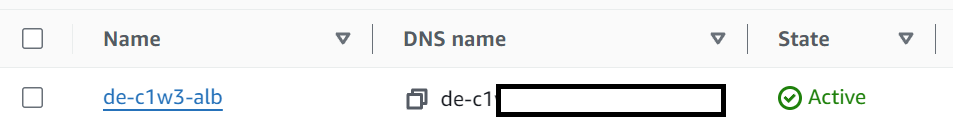

### 1. Introduction

1. **Three-Tier Architecture**:
   - A web application typically follows a three-tier architecture: 
     - **Presentation tier**: User interface (web page) where clients interact with the app and view dashboards.
     - **Logic tier**: Processes client input, queries data, and returns results to the presentation layer.
     - **Data tier**: Stores the data that supports the web app (e.g., in Amazon S3).
     

    - The web application in this lab is built using a three-tier architecture, and following is the architectural diagram:     
     

2. [**Amazon EC2 Auto Scaling Group**](https://docs.aws.amazon.com/autoscaling/ec2/userguide/what-is-amazon-ec2-auto-scaling.html):
   - EC2 instances act as the application servers running the business logic.
   - Auto Scaling allows dynamic adjustment of the number of EC2 instances based on demand, ensuring scalability and availability.

3. [**Application Load Balancer (ALB)**](https://docs.aws.amazon.com/elasticloadbalancing/latest/userguide/what-is-load-balancing.html):
   - ALB distributes incoming client requests across multiple EC2 instances to ensure load balancing and high availability.
   - ALB serves as the single entry point for client interactions with the web app.

4. **Virtual Private Cloud (VPC) and Subnets**:
   - VPC isolates resources like EC2 from external access, ensuring security.
   - Subnets within the VPC control which resources are publicly or privately accessible, enabling detailed access control.

### 2. Getting the Address of the Web Application

1. **Accessing the Application Load Balancer (ALB)**:
   - Navigate to the AWS console and search for **EC2**.
   
   - In the left panel, select **Load Balancers**.
   
   - Locate the load balancer named **de-c1w3-alb** and copy its **DNS Name**.
   

2. **Testing the Web Application**:
   - Open a new browser window and paste the **DNS Name** into the address bar.
   - You will see a simple message on the web page, representing a placeholder for the dashboard.
   

3. **HTTP Request**:
   - By opening the web page, you sent an **HTTP request** to the ALB via **port 80**, which is the default for HTTP.
 
### 3 - Monitoring CPU Usage and Networking Activity

1. **Purpose of Monitoring:**
   - To ensure your web app can handle incoming traffic, monitor its CPU and networking activity 
        using **Amazon CloudWatch**. This follows the **DataOps** and **Operational Excellence** 
        principles of the AWS Well-Architected Framework, emphasizing automation, monitoring, and adaptability.
    

2. **Stress Testing with Apache Benchmark:**
   - In **AWS CloudShell**, install the **Apache Benchmark tool** with the command:
     ```bash
     sudo yum install httpd-tools -y
     ```
   - Run a stress test by sending multiple concurrent HTTP GET requests:
     ```bash
     ab -n 7000 -c 50 http://<ALB-DNS>/
     ```
     - **Option -n**: Total number of requests (7000 in this case).
     - **Option -c**: Number of concurrent requests (50).

3. **Monitoring Metrics with CloudWatch:**
   - Go to **Auto Scaling Groups** in the AWS console (under the EC2 section).
   
   - Select your **Auto Scaling group** and navigate to the **Monitoring** tab.
   - Click on **EC2** to view metrics such as **CPU usage** and **Networking (inbound and outbound)**.
   - During the stress test, expect an increase in these metrics. CloudWatch updates may 
        take 5-10 minutes to reflect the changes.

4. **CloudWatch Overview:**
   - **AWS CloudWatch** allows users to collect and track resource metrics, monitor log files, 
        and set alarms. It's designed to offer a comprehensive view of AWS resources and services.
    

5. **Post-Stress Test:**
   - After the requests are complete, monitor the **reduction** in CPU and networking activity 
        as the system returns to normal usage levels.

### 4 - Enhancing Security

1. **Security Priority:**
   - Security is crucial, as highlighted by the AWS principle of "prioritize security." 
        It's necessary to secure data, systems, and assets and protect them from unauthorized access.

2. **Issue with Port 90:**
   - The ALB is displaying private data on port 90, which should only be accessible by certain personnel 
        within the company.
   - To address this, you need to restrict access to port 90 and allow inbound traffic only through port 80.

3. **Steps to Fix Security Issue:**
   - Paste the ALB DNS with port 90 (`<ALB-DNS>:90`) in the browser and notice that it shows private data.
   - In the **AWS console**, go to **EC2** and click on **Security Groups** on the left panel.
    

4. **Identify Security Groups:**
   - **de-c1w3-ec2-sg**: Security group for the EC2 instances.
   - **de-c1w3-alb-sg**: Security group for the Load Balancer.

5. **Edit Security Group Rules:**
   - Go to the security group **de-c1w3-ec2-sg** and ensure its inbound rule allows traffic only from the ALB.
   - Next, go to **de-c1w3-alb-sg** and check its inbound rule, which currently allows 
        **All TCP (port range: 0-65535)** from any IP (`0.0.0.0/0`). This is insecure.

6. **Modify Inbound Rules:**
   - Edit the rule for **de-c1w3-alb-sg** by deleting the open rule.
   - Add a new rule that only allows traffic through **port 80** and source **0.0.0.0/0**.
   - This restricts ALB access to port 80, blocking any unauthorized access on other ports like port 90.

7. **Test the Configuration:**
   - After applying the rule, point the browser to `<ALB-DNS>:90` and verify that access is now denied.
   - Check port 80 by going to `<ALB-DNS>` to ensure you can still access the dashboard.

8. **Security Improvement:**
   - By adjusting security group rules, you enhanced the overall security by restricting sensitive data 
        access on port 90, adhering to the **AWS Well-Architected Framework's Security pillar** 
        and the principle of "Prioritize security."

### 5 - Checking EC2 Availability

1. **EC2 Instances in Different Availability Zones (AZs):**
   - Each EC2 instance of your web application is deployed in a separate **Availability Zone (AZ)**, 
        enhancing fault tolerance and reliability by isolating them in independent data centers with 
        separate power, cooling, and networking.
   - This setup follows the **"Plan for failure"** principle, contributing to the **Reliability** 
        pillar of cloud-based architectures.

2. **Verifying Reliability:**
   - Place the **DNS Name** of your ALB into the browser and observe the message:  
     *"Dashboard data served from host `<host-internal-ip>.ec2.internal` in `<AZ>` availability zone"*
   - After refreshing the page, you will notice the internal IP and the AZ change, 
        confirming that traffic is being routed to different instances across AZs.

3. **Benefits of Multi-AZ Deployment:**
   - If a failure occurs in one AZ, the system will continue to serve data from other AZs, 
        ensuring **high availability** and **fault tolerance**.
   - Multi-AZ deployments mitigate risks of potential outages, allowing for seamless 
        failover and minimal downtime.

4. **Multi-Region Strategy:**
   - Beyond AZs, adopting a **multi-region** strategy further enhances reliability by 
        replicating applications and data across different geographical locations.
   - This ensures protection from regional disasters and infrastructure failures
        while providing **low-latency** access for global users.

### 6 - Performing Auto Scaling

1. **Using Resources Efficiently:**
   - Current EC2 instances are **t3.micro**; consider scaling down to **t3.nano** for efficiency.
   - Modify the Auto Scaling Group using **Launch Templates**:
     1. Go to the **EC2** service and select **Auto Scaling Groups**.
      
     2. In the **Details** tab, find the **Launch template** section and click **Edit**.
     
     3. Uncheck "Provide guidance to help me set up a template..." and select **t3.nano** in the Instance type section.
     
     4. Save the changes and ensure the latest version is selected in the Auto Scaling group.
     5. Terminate existing instances to launch new t3.nano instances, which will automatically replace them based on the desired capacity.

2. **Performing Auto Scaling:**
   - Enable Auto Scaling to dynamically adjust the number of EC2 instances based on demand.
   - Create a **Dynamic Scaling Policy**:
     1. In the **Auto Scaling Groups** section, choose your group and click on the **Automatic scaling** tab.
     2. Under **Dynamic scaling policies**, click **Create dynamic scaling policy**.
     3. Set properties:
        - **Policy type:** Target tracking scaling
        - **Scaling policy name:** de-c1w3-scaling-policy
        - **Metric type:** Application Load Balancer request count per target
        - **Target group:** de-c1w3-ec2-tg-port80
        - **Target value:** 60
        - **Instance warmup:** 60 seconds

3. **Testing the Scaling Policy:**
   - Perform an intense stress test using **Apache Benchmark**:
     - Run the command:  
       `ab -n 1000000 -c 200 http://<ALB-DNS>/`
   - Monitor CPU and Network metrics in the **Auto Scaling Groups** console.
   - Check the **Activity** tab for notifications on new instances being launched as demand increases.
   - Continue to monitor metrics and observe when instances are terminated as demand decreases.
