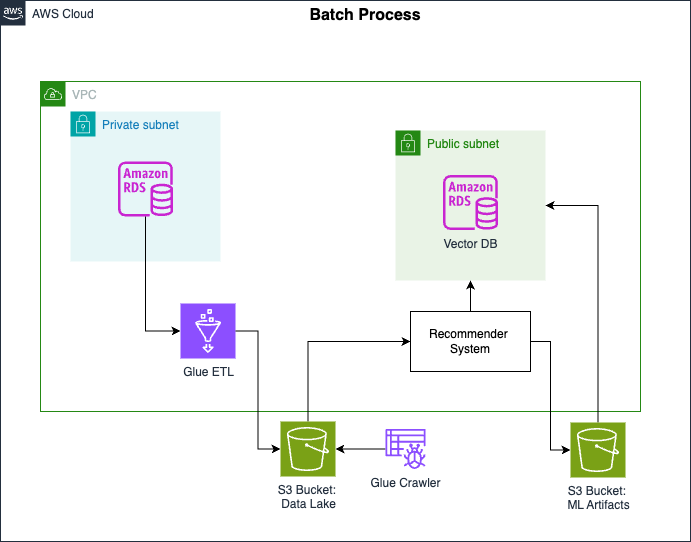
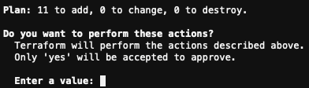
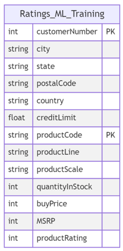
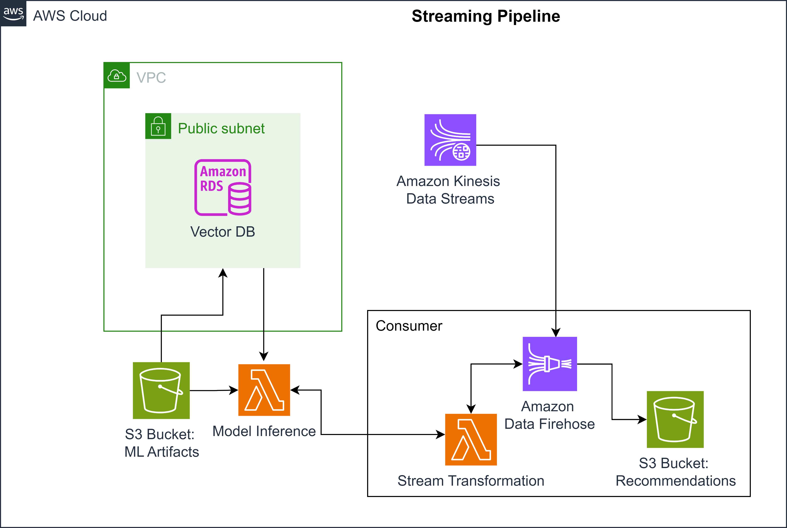

## Overview
1. **Lab Objectives**:
   - Implement the batch and streaming architectures to fulfill stakeholder requirements.
   - Start with the batch pipeline for the recommender system training data.
   - Store model output embeddings in a vector database.
   - Implement the streaming pipeline for real-time product recommendations.

2. **Batch Pipeline Implementation**:
   - Set up a pipeline to process and serve training data for the recommender system.
   - Utilize AWS Glue ETL to transform the input data and prepare it for model training.

3. **Vector Database Setup**:
   - Create and configure a vector database to store the output embeddings from the trained model.

4. **Streaming Pipeline Implementation**:
   - Develop a streaming architecture that leverages the trained model and vector database.
   - Ensure the pipeline provides real-time product recommendations based on user interactions.

5. **Overall Framework**:
   - Apply the principles of "Thinking like a Data Engineer" throughout the lab to ensure 
        effective data handling and processing.

## 1 - Implementing the Batch Pipeline
1. **Batch Pipeline Overview**: The batch pipeline ingests product and user data from an 
        Amazon RDS MySQL database, transforms it using AWS Glue ETL, and stores the transformed data 
        in an Amazon S3 bucket for training a recommender system.
        

2. **Additional Table**: The `ratings` table in the `classicmodels` MySQL Sample Database 
        contains user ratings for products on a scale from 1 to 5, generated specifically for this lab.

3. **Connecting to the Database**: 
   - **Get Endpoint**: Use the command to retrieve the database endpoint:
     ```bash
     aws rds describe-db-instances --db-instance-identifier de-c1w4-rds --output text --query "DBInstances[].Endpoint.Address"
     ```
   - **Connect**: Connect to the database using:
     ```bash
     mysql --host=<MySQLEndpoint> --user=admin --password=adminpwrd --port=3306
     ```
    
    - `<MySQLEndpoint>` with the output from the previous step,

    - `<DatabaseUserName>` with `admin`,

    - `<Password>` with `adminpwrd`: 

4. **Explore the `ratings` Table**: 
   - Switch to the `classicmodels` database:
     ```sql
     use classicmodels;
     ```
   - List tables to verify the `ratings` table:
     ```sql
     show tables;
     ```

5. **Query Data**: View the first 20 rows of the `ratings` table:
   ```sql
   SELECT * FROM ratings LIMIT 20;

**Running AWS Glue ETL Job**

6. **Setup the environment running the script `scripts/setup.sh`**:

    ```bash
    source ./scripts/setup.sh
    ```

7. **Go to the `terraform` folder**:

    ```bash
    cd terraform
    ```

8. **Initialize the terraform configuration**:

    ```bash
    terraform init
    ```

9. **Deploy the resources**: 
    ```bash
    terraform plan
    terraform apply
    ``` 
    

10. **Access AWS Glue Console**: 
   - Go to the AWS Management Console.
   - Search for "AWS Glue" and select it.

11. **Locate ETL Jobs**: 
   - In the left panel, click on **ETL jobs**.
   - Look for the job named `de-c1w4-etl-job`. This is the job created 
        for your batch pipeline.

12.  Start the AWS Glue job:

    ```bash
    aws glue start-job-run --job-name de-c1w4-etl-job | jq -r '.JobRunId'
    ```

13. **Check Job Status**:
   - Use the following command to check the status of the AWS Glue job, 
        replacing `<JobRunID>` with the actual output from the previous step:
   ```bash
   aws glue get-job-run --job-name de-c1w4-etl-job --run-id <JobRunID>
   ```

The transformed data has the following schema:    



14. **Check Transformed Data**:
   - After the AWS Glue job completes, navigate to the AWS console.
   - Search for **S3** and look for the bucket named `de-c1w4-<PLACEHOLDER>-datalake`.
   - Within the bucket, go to the folder `ratings-ml-training`.
   - You should see additional folders named `customerNumber=<NUMBER>`, indicating the data was 
        partitioned during storage.
   - This partitioning strategy will help organize the data for future access.

## 2 - Creating & Setting up the Vector Database

2.1. **Explore ML Artifacts**:
   - The Data Scientist has created an S3 bucket named 
        `de-c1w4-<AWS-ACCOUNT-ID>-us-east-1-ml-artifacts`.
   - Inside this bucket, you will find the following structure: 
    ```bash
    .
    ├── embeddings/
    |   ├── item_embeddings.csv
    |   └── user_embeddings.csv
    ├── model/
    |   └── best_model.pth   
    └── scalers/
        ├── item_ohe.pkl
        ├── item_std_scaler.pkl
        ├── user_ohe.pkl
        └── user_std_scaler.pkl   
    ```
    
- **Folders Explained**:
  - **embeddings/**: Contains user and item embeddings generated by the model.
  - **model/**: Contains the trained model for inference.
  - **scalers/**: Contains preprocessing objects like One Hot Encoders and Standard Scalers.

2.2. **Upload to Vector Database**:
- The Data Scientist requests to upload `item_embeddings.csv` and `user_embeddings.csv` 
        into a Vector Database (Vector DB).
- These embeddings will be used by the recommender system in the streaming pipeline 
        to provide product recommendations.
- The vector database accelerates retrieval of similar items; when a user adds an item 
        to the cart, the system computes the item's embedding vector and retrieves similar items from the Vector DB.

## Creating the Vector Database

2.3. **Set Up RDS PostgreSQL with pgvector**:
   - You will create an RDS PostgreSQL database using Terraform.
   - This database will include the `pgvector` extension to facilitate vector operations.

2.4. **Benefits of Using PostgreSQL for Vector DB**:
   - **Speed**: PostgreSQL typically performs faster for complex queries and data analysis compared to MySQL.
   - **Flexibility**: It offers more capabilities for working with vector data, allowing for advanced querying and data handling. 

2.5. **Deployment**:
   - Run `terraform init`, `terraform plan`, and `terraform apply` to create the database. 

2.6. **Retrieve Database Credentials**:
    
    - After running the `terraform apply` command, retrieve the sensitive fields using:
        ```bash
        terraform output vector_db_master_username
        terraform output vector_db_master_password
        ```
    - **Note**: The outputs will be in double quotes; make sure to exclude those when saving. 

2.7 **Connect to database**:

    ```bash
    psql --host=<VectorDBHost> --username=postgres --password --port=5432
    ```

2.8 **Running Script**:

    ```bash
    \i '../sql/embeddings.sql'
    ```
2.9. **Check the available tables**:

    ```bash
    \dt *.*
    ```
    - Press the `Q` key to quit the `psql` prompt.

## 3 - Connecting the Deployed Model to the Vector Database

1. **Understanding the Streaming Pipeline**:
   - The streaming workflow involves a Lambda function labeled as "model inference," which utilizes:
     - The trained model stored in S3.
     - The embeddings from the vector database.
    

## 3.1 - Configuring the Lambda Function for Vector Database Connection

1. **Accessing RDS Database**:
   - In the AWS Console, search for **RDS** and click on **Databases**.
   - Locate the database named `de-c1w4-vector-db` and click on it.

2. **Finding the Endpoint**:
   - Go to the *Connectivity & Security* tab.
   - Find and copy the endpoint, which should look like:
     ```
     de-c1w4-vector-db.xxxxxxxxxxxx.us-east-1.rds.amazonaws.com
     ```
   - Keep this value safe for later use.

3. **Configuring Lambda Function**:
   - In the AWS Console, search for **Lambda** and locate the function named `de-c1w4-model-inference`.
   - Click on the function name and navigate to the **Configuration** tab.
   - In the left panel, select **Environment Variables** and click on `Edit`.

4. **Setting Environment Variables**:
   - Enter the following values:
     - `VECTOR_DB_HOST`: Paste the endpoint from step 2.
     - `VECTOR_DB_PASSWORD`: Use the output from the command `terraform output vector_db_master_password`.
     - `VECTOR_DB_USER`: Use the output from the command `terraform output vector_db_master_username`.
   - Click on `Save` to apply the changes.

## 4 - Implementing the Streaming Pipeline

1. **Understanding the Components**:
   - The streaming pipeline includes:
     - **Kinesis Data Streams**: Receives online user activity from the sales platform logs.
     - **Kinesis Data Firehose**: A delivery service that loads data streams into S3.
     - **Lambda Function (Stream Transformation)**: Extracts user and product features, 
            applies the trained recommender model, and loads recommendations into the S3 recommendation bucket.

2. **Using Terraform**:
   - You will create the following resources using Terraform:
     - **Kinesis Firehose**: To deliver data streams to S3.
     - **S3 Recommendation Bucket**: To store the recommendations.
     - **Lambda Function**: For processing the data stream.

3. **Creating Resources with Terraform**:
   - Navigate to the Terraform configuration files for the streaming pipeline.
   - Update the main Terraform file to include the necessary modules for Kinesis Firehose, S3 bucket, and Lambda function.
   - Run the following commands in your terminal:
     ```bash
     terraform init
     terraform plan
     terraform apply
     ```

4. **Verification**:
   - After the Terraform `apply` command completes, verify the resources in the AWS console:
     - Check for the newly created Kinesis Firehose and S3 recommendation bucket.
     - Confirm that the Lambda function is set up and ready to process data streams.
