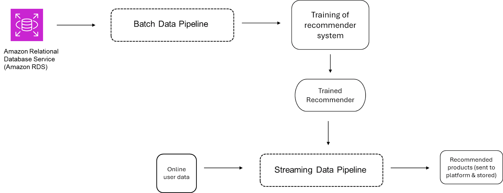

## Translating Requirements to Architecture

Practice gathering stakeholder needs and translating them into system requirements. 
Choose the appropriate tools and technologies based on the system requirements, 
then build an end-to-end data system that includes a batch and a streaming component to 
train a product recommendation system and serves product recommendations to a sales platform.

### Learning Objectives
- Design a data architecture on AWS based on stakeholder requirements.
- Implement a batch and streaming pipeline on AWS

### Outlines
1. [Stakeholder Management & Gathering Requirements](#stakeholder-management--gathering-requirements)
- 1.1 [Requirements](#requirements)
- 1.2 [Conversation with Matt Housley](#conversation-with-matt-housley)
- 1.3 [Conversation with the CTO](#conversation-with-the-cto)
- 1.4 [Conversation with Marketing](#conversation-with-marketing)
- 1.5 [Breaking Down the Conversation with Marketing](#breaking-down-the-conversation-with-marketing)
- 1.6 [Conversation with the Software Engineer](#conversation-with-the-software-engineer)
- 1.7 [Documenting Nonfunctional Requirements](#documenting-nonfunctional-requirements)
- 1.8 [Requirements Gathering Summary](#requirements-gathering-summary)

2. [Translating Requirements to Architecture](#translating-requirements-to-architecture)
- 2.1 [Follow-up Conversation with the Data Scientist](#follow-up-conversation-with-the-data-scientist)
- 2.2 [Conversation Take-Aways](#conversation-take-aways)
- 2.3 [Extracting Functional & Nonfunctional Requirements](#extracting-functional--nonfunctional-requirements)
- 2.4 [AWS Services for Batch Pipelines](#aws-services-for-batch-pipelines)
- 2.5 [AWS Services for Streaming Pipelines](#aws-services-for-streaming-pipelines)
- 2.6 [AWS Services to Meet Your Requirements](#aws-services-to-meet-your-requirements)

## Stakeholder Management & Gathering Requirements 

1. **Requirements Gathering:**
   - In Week 1, we explored how a conversation with a data scientist could reveal the 
        need to engage other stakeholders (e.g., marketing teams, software engineers).
   - We introduced a framework for thinking like a data engineer, emphasizing the identification 
        of business goals and stakeholder needs, defining system requirements, choosing tools, 
        and deploying the system.

2. **The Data Engineering Framework:**
   - The framework involves: 
     1. Identifying business goals.
     2. Defining system requirements.
     3. Choosing the right tools and technologies.
     4. Building and deploying the system.
   - Key components of each step include gathering stakeholder input, translating needs 
        into system requirements, prototyping/testing, and evolving the system.

3. **Weeks 2 and 3 Focus:**
   - **Week 2:** Examined the data engineering lifecycle, focusing on system components 
        and stakeholder interactions, including source system owners and downstream end users.
   - **Week 3:** Focused on principles of good data architecture, such as planning 
        for failure and choosing common components from the start.

4. **Practical Application in Week 4:**
   - This week, the focus shifts to applying the mental model in a practical job scenario, 
        covering requirements gathering, tool selection, and system implementation.
   - You will define functional and non-functional requirements and design an architecture 
        that will be implemented on AWS Cloud.

5. **Best Practices:**
   - Throughout the week, important concepts and best practices will be highlighted, 
        helping prepare for real-world scenarios encountered as a data engineer.

### Requirements 

1. **Hierarchy of Needs:**
   - At the top of the hierarchy are **business goals**, which define success for the company 
        (e.g., growing revenue, market share).
   - Below that are **stakeholder needs**, which represent what individual employees need to succeed 
        (e.g., robust data systems).
   - At the bottom are **system requirements**, divided into:
     - **Functional requirements**: Specific system capabilities 
            (e.g., reporting fraudulent transactions).
     - **Non-functional requirements**: Attributes like latency, scalability, 
            and reliability (e.g., scaling to handle 10,000 users).

3. **Importance of Connecting Goals to Systems:**
   - Your data engineering work is directly linked to stakeholder needs and business objectives,
        making it essential to understand the company's goals to design effective systems.

4. **Requirements Gathering:**
   - Ideal requirements gathering starts from the top by talking to leadership (e.g., CEO or CTO) 
        to understand business goals before moving down to stakeholder needs.
   - At larger companies, talking to a CTO or equivalent leader is key, as they oversee technology 
        strategies aimed at growing the business.
 
### Conversation with Matt Housley  

1. **Book Motivation:**
   - The book *Fundamentals of Data Engineering* was written to fill a gap in education by 
        focusing on defining data engineering as a field, not just on tools and technologies.
   - The aim was to provide a first-principles approach to data engineering, giving readers 
        a mental framework to think and operate like a data engineer.

2. **Target Audience:**
   - Primary audience: Technically skilled individuals looking to transition into data engineering.
   - Secondary audience: Non-data engineers, like product managers, who work closely with data 
        engineers and need to understand the field better.

3. **Course and Book Connection:**
   - The course complements the book by allowing learners to apply the concepts they've learned 
        with hands-on labs using tools and technologies, specifically within AWS, to give 
        practical experience.

4. **Advice for Aspiring Data Engineers:**
   - Start by learning core data concepts, such as working with tabular data (e.g., using Excel).
   - Gaining general competence across various tools is crucial before specializing in a particular 
        tech stack at a company.
   - Focus on understanding how analytics data is consumed and used, which may differ from typical 
        software development.

5. **Importance of Mental Framework:**
   - Having a mental framework allows you to think like a data engineer and categorize tools and 
        technologies properly, which makes adapting to different tech stacks easier in real-world scenarios.
 
### Conversation with the CTO 

1. **Business Goals Overview:**
   - The company is focused on expanding market share, offering new products, and growing internationally.
   - There are concerns about outdated technology that could cause outages and harm the customer experience.
   - The company aims to refactor legacy systems to improve scalability and avoid risks of outages.

2. **Refactoring & Modernization:**
   - The refactoring initiative will aim to eliminate old code and modernize systems to make the platform 
        more scalable and stable.
   - A key challenge is the "software-data divide," where legacy systems generate data that is difficult 
        to use for analytics.

3. **Data Engineer Role in Modernization:**
   - As part of the refactoring process, the data engineer will consult with software engineers to ensure 
        that the data generated is suitable for analytics with minimal ETL processing.
   - The focus is on generating better data schemas to streamline the analytics process.

4. **Technologies Involved:**
   - The company is transitioning from batch-based to streaming-based data processing.
   - Tools like **AWS Kinesis** and **Kafka** will be used for streaming data pipelines.
   - The data engineer will be responsible for experimenting with these technologies and managing streaming 
        data as the company scales.

5. **Machine Learning & AI Initiatives:**
   - The company aims to improve customer retention through a recommendation engine.
   - The data engineer will build pipelines to feed this engine, working with data scientists on customer 
        behavior data, clickstream data, and product taxonomy.

6. **Collaboration & Growth:**
   - The data engineer will work closely with software engineers, the head of data, and data scientists.
   - The goal is to develop proof of concept projects for streaming technologies and contribute to key 
        company initiatives such as system refactoring and AI-driven customer retention.

### Conversation with Marketing

1. **Dashboard Data Lag Issue:**
   - The marketing team has dashboards that display sales metrics by category, region, and time, 
        but there is a **two-day lag** in the data, making it difficult to respond quickly to trends.

2. **Need for Real-Time Data:**
   - The marketing team wants **real-time data** to identify and act on regional spikes in product 
        demand as they happen, enabling them to push **targeted promotions** when a trend is still ongoing.

3. **Product Recommendation System Enhancement:**
   - The current recommendation system displays **popular products of the week**, but it’s not personalized.
   - The marketing team desires a **personalized recommendation system** that takes into account a customer’s 
        purchase history and the items in their cart.

4. **Immediate Action with Timely Data:**
   - If the dashboards could show **data that is only one hour old**, the team would be able to take swift 
        action by running targeted marketing campaigns.

5. **Prototype Systems:**
   - Both the dashboards and the recommendation system are in a **prototype state**, and the marketing team is 
        looking to improve these systems for better functionality and impact.

### Breaking Down the Conversation with Marketing

1. **Business Goals:**
   - Focus on **customer retention and loyalty**.
   - Expand to **new markets** and **new product offerings**.
   - Become **data-driven** in decision-making.

2. **Stakeholder Needs:**
   - **Analytics Dashboards**:
     - Require **real-time data** to monitor sales trends and spikes in demand.
     - **Hourly data updates** would meet the need to launch promotional campaigns based on spikes.
   - **Recommender System**:
     - Needs to provide **personalized product recommendations** based on customer browsing history, 
            purchase history, and items in the checkout cart.

3. **Functional Requirements:**
   - **For Dashboards**: 
     - The data system should provide **transformed data** that is no more than **one hour old** for 
            accurate real-time insights.
   - **For Recommender System**:
     - The system needs to provide **training data** for the recommender model, ingest customer data, 
            and serve the recommendations back to the platform in the form of product IDs.

### Conversation with the Software Engineer

1. **Data Ingestion Challenges**:  
   - Data scientists often face issues with **data unavailability** or **schema changes** 
        that break their processing scripts.
   - Direct access to the production database is not an option due to potential risks, 
        leading to the current suboptimal daily file delivery system.

2. **Proposed Solution**:  
   - A **read replica** of the production database is proposed to provide continuous access 
        to real-time data without impacting the production system.
   - The read replica would be updated immediately after new data is recorded and accessible 
        via an API.

3. **Mitigating Data Availability Issues**:  
   - While the read replica should reduce delays in data availability, **system outages** 
        (e.g., server or data center failures) could still cause data to be temporarily unavailable.
   - **Automatic notifications** can be sent to downstream users during outages to alert them.

4. **Handling Schema Changes**:  
   - Schema changes occur when new platform features are added or product lines expand, altering the recorded data.
   - Typically, the software team is aware of schema changes about **one week in advance**, and they can 
        provide notifications to downstream teams.
   - Building **automatic checks** in the data pipeline to verify schema conformity is also recommended.

5. **Collaboration and Stability**:  
   - Open communication between the data engineering and software teams is key to anticipating changes
        and ensuring data stability.
   - The software team is willing to notify data engineers of **schema changes** and provide 
        **consistent data access** via the read replica API.

### Documenting Nonfunctional Requirements
1. **Key Insights from Software Engineer**:  
   - Proposed setting up a **read replica database** and an API for continuous data access while 
          safeguarding production systems.
   - Assurance of notifications for system outages and upcoming schema changes to facilitate 
          better data management.

2. **Documenting Requirements Hierarchy**:  
   - Structure requirements hierarchically: business goals at the top, followed by stakeholder needs, 
          and then functional and nonfunctional requirements.

3. **Nonfunctional Requirements for Analytics Dashboards**:  
   - **Scalability and Latency**: The system must scale to handle varying data volumes without 
          increasing processing latency, ensuring data is available no more than one hour post-recording.
   - **Reliability**: Implement data quality checks to ensure the ingested data conforms to expected formats.
   - **Maintainability**: The ingestion and transformation processes should be adaptable to accommodate any 
          schema changes.

4. **Nonfunctional Requirements for Recommender System**:  
   - **Latency**: The system must deliver recommendations within **one second** of receiving user data.
   - **Scalability**: Must handle the maximum number of concurrent users effectively.
   - **Reliability**: In case of a failure, the system should default to showing a selection of the 
          most popular products to maintain user experience.

5. **Importance of Requirements Understanding**:  
   - Emphasizes the need to consider both functional and nonfunctional requirements in the context of 
          how they support stakeholder needs and overall business goals.

### Requirements Gathering Summary

1. **Importance of Requirements Gathering**: Understand stakeholder needs in the context of broader business 
          goals by engaging with various team members, from leadership to data scientists.

2. **Open-Ended Questions**: Ask open-ended questions to uncover current system issues and stakeholders' 
          intended actions with the data.

3. **Documentation**: Properly document all findings, including functional and nonfunctional requirements, 
          to confirm that the planned system meets stakeholder and business needs.

4. **Evaluating Trade-Offs**: Recognize the tension between timeline, scope, and cost, often referred to 
          as the "iron triangle." Conversations with stakeholders should prioritize what is most 
          important—features, timeline, or budget.

5. **Breaking the Iron Triangle**: Use principles like building loosely coupled systems and 
          understanding stakeholder needs to manage trade-offs effectively, enabling high-quality 
          data systems within predictable timelines and budgets.
 
## Translating Requirements to Architecture 
     The lesson aims to simulate the journey from requirements gathering to implementation 
          in a project, providing a condensed experience compared to real-world timelines.

### Follow-up Conversation with the Data Scientist

1. **Recommender System Overview**: The data scientist is developing a content-based recommender system 
          using user and product features to compute vector embeddings for recommendations.

2. **Training Data Structure**: The training data is in a tabular format, with rows for product purchases 
          that include user features (e.g., customer number, credit limit) and product features 
          (e.g., product code, quantity in stock), along with a rating value from 1 to 5.

3. **Model Retraining Frequency**: The data scientist is unsure about the retraining frequency but 
          suggests monitoring model performance. Possible retraining could occur weekly, monthly, 
          or quarterly, depending on data drift and operational overhead.

4. **Recommendation Input**: The model will take user information and product browsing data as inputs 
          to generate recommendations for products.

5. **Latency Requirements**: Recommendations need to be generated almost instantaneously 
          (within one or two seconds) to match the browsing experience.

6. **Model Performance**: The model is efficient, taking only a few milliseconds to generate 
          recommendations due to pre-computed vector embeddings.

7. **Scalability Concerns**: The company currently has around 100,000 customers, with activity spikes 
          of up to 10,000 concurrent users expected in the future, necessitating a scalable solution.

### Conversation Take-Aways 

1. **Data Pipeline Tasks**:
   - Build a **batch data pipeline** to serve training data for the recommender system.
   - Build a **streaming data pipeline** to provide top product recommendations based on 
          user online activity.
     

2. **Recommendation Logic**:
   - The recommender system will generate product recommendations based on:
     - User information (e.g., preferences)
     - Products the customer has been browsing or has in their cart.

3. **Lab Focus**:
   - The lab will provide an end-to-end example of both batch and streaming pipelines.
   - The focus will be on integrating computations of the recommender system into the streaming pipeline, 
          not on fine-tuning the model's performance.

4. **Data and Features**:
   - The data used in the lab is the same as in week 2 and may lack strong predictive features for 
          user and product characteristics.

5. **Vector Embeddings**:
   - The recommendation model will compute two types of vectors:
     - **Product Embedding Vector**: Contains information about product characteristics.
     - **User Embedding Vector**: Holds information about user preferences for product characteristics.

### Extracting Functional & Nonfunctional Requirements

#### Batch Pipeline Requirements

- **Functional Requirements**:
1. **Data Ingestion**: The pipeline must ingest user and product data in a tabular format 
          for training the recommender system.
2. **Data Transformation**: The pipeline should transform the ingested data into a format 
          suitable for training, including user features (e.g., customer number, credit limit, city) 
          and product features (e.g., product code, quantity, buy price).
3. **Batch Delivery**: The pipeline must deliver the transformed training data to the data 
          scientist on a regular basis for model retraining.
- **Nonfunctional Requirements**:
1. **Scalability**: The pipeline must be able to handle increases in data volume as the 
          number of users and products grows.
2. **Operational Overhead**: The process of delivering training data should not require excessive 
          operational overhead, allowing for easy updates to the data format if new features are added.
3. **Performance**: The pipeline should efficiently process and deliver batches of data in a timely 
          manner to support model retraining.

#### Streaming Data Pipeline Requirements

- **Functional Requirements**:
1. **Real-Time Data Ingestion**: The pipeline must stream user activity data in real-time from the event 
          log to generate recommendations.
2. **Recommendation Generation**: The pipeline should utilize the trained recommender model to generate product 
          recommendations based on user information and browsing/cart data.
3. **Recommendation Delivery**: The pipeline must deliver the product recommendations back to the platform 
          for user presentation.
- **Nonfunctional Requirements**:
1. **Latency**: The system must generate recommendations with a latency of less than one second, enabling a 
          seamless user experience as they browse or check out.
2. **Scalability**: The pipeline should support a varying number of concurrent users, with an expected load of 
          up to 10,000 users simultaneously.
3. **Reliability**: The system should ensure high availability and provide consistent recommendations even during peak loads.

### AWS Services for Batch Pipelines

1. **Understand Requirements**: Clearly define system requirements, similar to choosing the right vehicle 
          for transportation based on the destination, team size, and urgency.

2. **ETL Pipeline Approach**: Use an Extract, Transform, Load (ETL) pipeline to ingest tabular data from a 
          source system (e.g., Amazon RDS), apply necessary transformations, and load the data for access.

3. **Serverless Options**:
   - **AWS Lambda**: Suitable for simple tasks but has limitations (e.g., 15-minute timeout).
   - **Amazon Glue ETL**: More convenient for batch processing with features like crawlers for automatic metadata 
          generation and a visual ETL interface.
   - **Amazon EMR Serverless**: Offers more control for complex big data tasks, supporting frameworks like 
          Apache Spark and Hadoop.

4. **Storage Solutions**: Depending on downstream use cases:
   - **Amazon RDS**: Good for normalized tabular data.
   - **Amazon Redshift**: Ideal for complex queries on large datasets but at a higher cost.
   - **Amazon S3**: Cost-effective and flexible option for staging data, allowing integration with other 
          AWS services.

5. **Consider Multiple Buckets**: When building data pipelines, utilize multiple S3 buckets for different stages 
          of the ETL process based on specific tasks.

### AWS Services for Streaming Pipelines
1. **Streaming Data Sources**: Streaming data can come from IoT devices, click-stream data, or databases using 
          Change Data Capture (CDC). Avoid custom EC2 solutions unless necessary.

2. **Amazon Kinesis Data Streams**:
   - Enables real-time data ingestion from various producers (e.g., web servers, IoT devices).
   - Supports multiple data formats (JSON, XML, etc.) and stores data for a configurable time 
          (default 24 hours).
   - Multiple consumers can process the same data in different ways, facilitating real-time analysis.

3. **Amazon Managed Streaming for Apache Kafka (MSK)**:
   - Fully managed service for Apache Kafka, allowing users to build and run streaming applications 
          without managing the infrastructure.
   - Supports existing Kafka applications and tooling.
   - Offers greater flexibility and control compared to Kinesis, suitable for those familiar with Kafka.

4. **Amazon Kinesis Data Firehose**:
   - Simplifies the process of moving streaming data to storage (e.g., S3, Redshift) without writing 
          custom code.
   - Integrates seamlessly with Kinesis Data Streams and over 20 other AWS sources, making it easier to 
          manage streaming data flows.

5. **Choosing Between Services**:
   - Kinesis is recommended for ease of use and lower operational overhead, ideal for beginners.
   - MSK is better for those with existing Kafka knowledge or needing more control over their 
          streaming architecture.

 