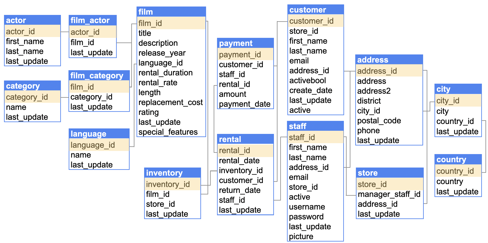

##  Lab: DVD Rental Database

### Objective
As a Data Engineer, you will learn to query and manipulate data using SQL in a DVD rental sample 
relational database. Your goal is to extract valuable insights about stores, customers, and rented films.

## Database Overview

In this lab, you will work with a modified version of the **Sakila Sample Database** under the assumption 
that it belongs to **Rentio**, a fictitious movie rental company. This database contains detailed information 
about stores, staff, customers, films, and rental transactions.

### Key Tables in the Rentio Database

- **actor**: Stores actor data, including first and last names.
- **address**: Contains address details for staff and customers.
- **category**: Lists categories for films.
- **city**: Includes city names.
- **country**: Contains country names.
- **customer**: Holds customer information, such as names and account status.
- **film**: Contains film details like titles, descriptions, languages, and ratings.
- **film_actor**: Represents the relationship between films and actors.
- **film_category**: Represents the relationship between films and categories.
- **inventory**: Tracks inventory data for films at specific stores.
- **language**: Contains language names associated with films.
- **payment**: Holds payment transaction details, including amounts and dates.
- **rental**: Records rental transactions, linking customers, staff, and rental details.
- **staff**: Contains staff information, including names and store assignments.
- **store**: Holds data about each store, including manager and address.

### Entity-Relationship Model (ERM)
Below is the entity-relationship model illustrating the structure of the Rentio database and the relationships between the tables:



### Objectives
Throughout this lab, you will execute SQL queries on the various tables in this database to help Rentio analyze:

- The most rented films based on different attributes.
- Customer behaviors and preferences.
- Inventory management insights.

## Running SQL Commands in a Notebook
### Load the ipython-sql extension to enable SQL magic commands in the JupyterLab notebook.
``` python
%load_ext sql
```

### Connect to MYSQL database 
``` python
import os 
import socket

from dotenv import load_dotenv

load_dotenv('./src/env', override=True)

DBHOST = socket.gethostname()
DBPORT = os.getenv('DBPORT')
DBNAME = os.getenv('DBNAME')
DBUSER = os.getenv('DBUSER')
DBPASSWORD = os.getenv('DBPASSWORD')

connection_url = f'mysql+pymysql://{DBUSER}:{DBPASSWORD}@{DBHOST}:{DBPORT}/{DBNAME}'

%sql {connection_url}
```

## 3 - Create, Read, Update, and Delete (CRUD) Operations

1. **CREATE TABLE**: Create a new table.
```sql
CREATE TABLE table_name (
    column1 datatype,
    column2 datatype,
    column3 datatype,
   ...
);
```

2. **SELECT**: Retrieve data from one or more tables.
```sql
SELECT
    column1,
    column2,
    column3,
    ...
FROM table_name;
```
- Use `*` to get all columns from the table
- Use `LIMIT` to limit the number of rows the query is running

3. **WHERE** - Condition filtering

```sql
SELECT
    *
FROM table_name
WHERE column1 = 'value1';
```

4. **INSERT INTO** - Insert new rows into a table.
```sql
INSERT INTO table_name (
  column1,
  column2,
  column3,
  ...
)
VALUES (
  'value1',
  'value2',
  'value3',
  ...
);
```

5. **UPDATE**: Modify existing records in a table.

```sql
UPDATE table_name
SET
  column2 = 'value2',
  column3 = 'value3',
...
WHERE column1 = 'value1';
```

6. **DELETE**: Remove records from a table.

```sql
DELETE FROM table_name
WHERE column1 = 'value1';
```

## SQL Clauses
### Aliases
Aliases temporarily change the name of a column for better readability.

```sql
SELECT
    column1 AS Alias_Column_1,
    column2 AS Alias_Column_2,
    column3 AS Alias_Column_3,
    ...
FROM table_name;
```

### JOIN
- Combines data from multiple tables based on a shared column.

```sql
SELECT
    *
FROM table1
JOIN table2 ON table1.column1 = table2.column2;
```

-  **Default Behavior**: By default, `JOIN` is equivalent to `INNER JOIN`, returning only matching 
    rows from both tables.

- **Types of Joins**:
   - **LEFT JOIN**: Returns all rows from the left table and matching rows from the right. 
   Non-matching rows from the left include nulls for right table columns.
   - **RIGHT JOIN**: Returns all rows from the right table and matching rows from the left. 
   Non-matching rows from the right include nulls for left table columns.
   - **FULL JOIN**: Combines results of both `LEFT JOIN` and `RIGHT JOIN`, returning all rows with matches 
   where available, and nulls where there are no matches.

### GROUP BY
- Groups rows with the same values in specified columns into summary rows.

- Often used with aggregate functions like `COUNT`, `MAX`, `MIN`, `SUM`, and `AVG` 
    to perform calculations on each group.
 
 ```sql
SELECT
    column1,
    COUNT(column2),
    SUM(column3)
FROM table1
GROUP BY column1;
```

### ORDER BY 

- Sort the rows in ascending or descending order based on one or more columns.
- Use `DESC` keyword to order the rows in descending order.

```sql
SELECT
    *
FROM table1
ORDER BY column1 DESC;
```