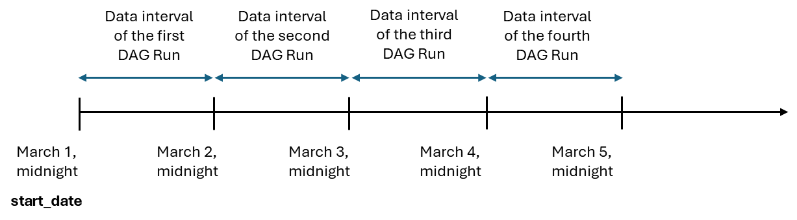
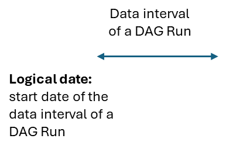
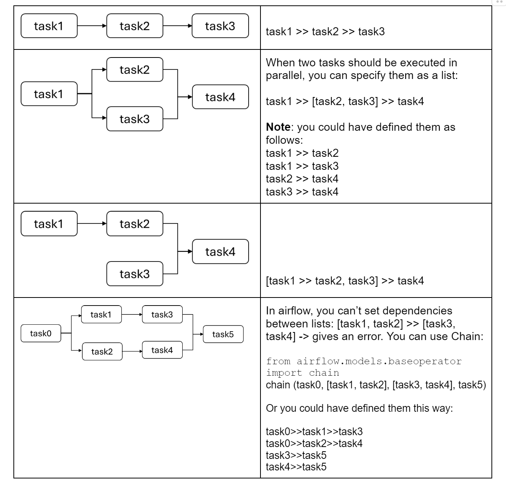

## Orchestration, Monitoring, and Automating Your Data Pipelines

This week, you will learn all about orchestrating your data pipeline tasks.
You'll identify the various orchestration tools, but will focus on Airflow 
-- one of the most popular and widely used tools in the field today. 
You'll explore the core components of Airflow, the Airflow UI, and how 
to create and manage DAGs using various Airflow features.

### Learning Objectives
- Explain how orchestration can be applied to a data pipeline and 
    list its benefits
- List and interact with the core components of Airflow
- Build data pipelines with DAGs in Airflow using features such as 
    Taskflow API, operators, XCom, variables, etc.
- Apply the best practices in building DAGs in Airflow
- Integrate data quality testing using Great Expectations in an 
    orchestrated pipeline in Airflow

### Outlines
1. [Orchestration Overview](#orchestration-overview)
- 1.1 [Overview](#overview)
- 1.2 [Before Orchestration](#before-orchestration)
- 1.3 [Evolution of Orchestration Tools](#evolution-of-orchestration-tools)
- 1.4 [Orchestration Basics](#orchestration-overview)
2. [Airflow](#airflow)
- 2.1 [Airflow - Core Components](#airflow---core-components)
- 2.2 [Airflow - The Airflow UI](#airflow---the-airflow-ui)
- 2.3 [Airflow - Creating a DAG](#airflow---creating-a-dag)
- 2.4 [Additional Notes About Airflow Basic Concepts](#additional-notes-about-airflow-basic-concepts)
- 2.5 [Airflow - XCom and Variables](#airflow---xcom-and-variables)
- 2.6 [Best Practices for Writing Airflow DAGs](#additional-notes-about-airflow-basic-concepts)
- 2.7 [Airflow - Taskflow API](#airflow---taskflow-api)
- 2.8 [Example on Branching in Airflow](#example-on-branching-in-airflow)
- 2.9 [Orchestration on AWS](#orchestration-on-aws)
3. Labs
- 3.1 [Lab 1 - Airflow 101 - Building Your First Data Pipeline](./Lab%201%20-%20Airflow%20101%20-%20Building%20Your%20First%20Data%20Pipeline/)
- 3.2 [Lab 2 - Airflow 101 - Best Practices](./Lab%202%20-%20Airflow%20101%20-%20Best%20Practices/)
- 3.3 [Lab 3 - Building an Advanced Data Pipeline With Data Quality Checks](./Lab%203%20-%20Building%20an%20Advanced%20Data%20Pipeline%20With%20Data%20Quality%20Checks/)

## Orchestration Overview
### Overview
1. **Overview of the Week**
   - Focus on orchestration, closely linked to previous DataOps concepts: automation, 
    observability, and monitoring.

2. **Building on Previous Knowledge**
   - Previous weeks included:
     - Using Terraform for infrastructure as code.
     - Implementing data quality checks and monitoring with Great Expectations 
        and CloudWatch.

3. **Introduction to Orchestration**
   - Orchestration automates individual tasks in data pipelines.
   - Transition from infrastructure as code to pipelines as code using Airflow.

4. **Connection to DataOps**
   - Orchestration is integral to at least two of the three DataOps pillars.
   - Related to data management and software engineering within the data engineering 
   lifecycle.

5. **Evolution of Orchestration Tools**
   - Discussion of historical setup of pipelines before orchestration tools.
   - Examination of the evolution of orchestration tools and potential future developments.

6. **Implementing Orchestration**
   - Basic implementation details for orchestration in data pipelines.
   - Introduction to various orchestration tools, emphasizing Airflow as the industry standard.

7. **Focus on Airflow**
   - In-depth exploration of Airflow, the primary tool for this week’s lab and common in 
    data engineering roles.

### Before Orchestration
1. **Historical Context of Data Pipelines**
   - Before orchestration tools, data pipelines were often automated using Cron jobs, 
        a command-line utility introduced in the 1970s.

2. **Cron Job Basics**
   - Cron jobs are scheduled using a specific structure: five numbers indicating time 
        parameters followed by the command to execute.
     - Format: `minute hour day_of_month month day_of_week command`
     - An asterisk (*) can be used in place of any number to indicate no restrictions.

3. **Example of Cron Job Scheduling**
   - Example: `0 0 1 1 * echo "Happy New Year"` executes at midnight on January 1st each year.
   - Practical Example: Scheduling data ingestion from a REST API:
     - `0 0 * * * python ingest_from_rest_api.py` (runs at midnight every night).
     - Followed by transformation: `1 0 * * * python transform_api_data.py` (runs at 1 AM).
     - Database ingestion: `0 0 * * * python ingest_from_database.py` (also runs at midnight).
     - Combining data: `2 0 * * * python combine_api_and_database.py` (runs at 2 AM).

4. **Limitations of Pure Scheduling**
   - A pure scheduling approach can lead to several failures:
     - Task failures, delays, or unexpected results can cause the entire pipeline to fail.
     - Lack of built-in monitoring means issues may go unnoticed until stakeholders report problems.

5. **Use Cases for Cron Jobs**
   - Cron jobs can be useful for simple tasks without dependencies or in the prototyping phase.
   - They provide an intuitive way to understand automation, but are not recommended for complex 
        data pipelines.

6. **Transition to Orchestration Tools**
   - The next discussion will focus on how orchestration tools have evolved to improve data 
        pipeline management.

### Evolution of Orchestration Tools

1. **Historical Context of Orchestration**
   - Orchestration has been crucial for data processing but was largely inaccessible to 
        smaller companies until recently.
   - Building in-house solutions was complicated and expensive before the rise of 
        open-source and managed tools.

2. **Evolution of Orchestration Tools**
   - In the late 2000s, **Facebook** developed **Data Swarm** for internal use, 
        which is still in use today.
   - **Apache Oozie** gained popularity in the 2010s but was designed primarily for Hadoop clusters, 
        limiting its usability in heterogeneous environments.
   - Inspired by these earlier tools, **Airbnb** introduced **Apache Airflow** in 2014, 
        which has since become the industry standard.

3. **Airflow's Significance**
   - Airflow was created to meet Airbnb's internal data orchestration needs and was 
        built as a noncommercial open-source project.
   - The framework gained traction quickly, becoming an **Apache incubator project** 
        in 2016 and a full Apache project in 2019.
   - **Advantages of Airflow**:
     - Written in Python, making it highly accessible.
     - Active open-source community with frequent updates and quick bug fixes.
     - Available as a managed service from vendors like AWS, GCP, and Astronomer.io 
        for those needing additional support.

4. **Limitations of Airflow**
   - While Airflow is widely used, it has shortcomings in areas like scalability, 
        data integrity, and streaming pipelines.
   - Alternatives are emerging:
     - **Luigi** and **Conductor** are notable open-source projects.
     - Newer tools like **Prefect**, **Dagster**, and **Mage** aim to improve on 
            Airflow's core design, focusing on scalability, data quality testing, 
            and data transformations.
     - Some tools are specifically designed to enhance orchestration for streaming pipelines.

5. **Future Considerations**
   - There is potential for newer tools to become widely adopted as alternatives to Airflow, 
        depending on specific pipeline needs.
   - Recommendation: Focus on learning Airflow due to its current prevalence in the industry, 
        while staying updated on developments in other orchestration tools.

### Orchestration Basics 

1. **Orchestration Overview**
   - Orchestration enhances automation beyond simple scheduling (like Cron) by enabling:
     - Task dependencies
     - Monitoring and alerts
     - Fallback plans for unexpected issues

2. **Directed Acyclic Graph (DAG)**
   - Visual representation of data pipelines:
     - **Nodes** represent tasks.
     - **Edges** represent the flow of data between tasks.
   - DAGs ensure data flows in one direction without cycles, preventing downstream 
        failures from overlapping task execution.

3. **Task Dependencies**
   - Orchestration frameworks, including Airflow, require the definition of tasks as a DAG.
   - Dependencies can be set to ensure tasks complete before the next one begins, 
        preventing issues seen with Cron scheduling.

4. **Defining and Visualizing DAGs in Airflow**
   - DAGs are defined programmatically using Python.
   - Airflow provides a user interface (UI) for:
     - Visualizing DAGs
     - Monitoring task progress
     - Troubleshooting issues

5. **Scheduling DAGs**
   - DAGs can be set to run based on:
     - **Time-based** schedules (e.g., daily at midnight).
     - **Event-based** triggers (e.g., dataset updates or file uploads).
   - Example: Use a **sensor** task in Airflow to wait for a file to appear 
        in an S3 bucket before proceeding.

6. **Monitoring and Alerts**
   - Orchestration allows setting up monitoring and alerts for task failures 
        and execution durations.
   - Data quality checks can be integrated to ensure data integrity 
        (e.g., checking for null values or validating data schemas).

7. **Universal Concepts**
   - While demonstrated in Airflow, the principles of task dependencies, 
        scheduling, monitoring, and data quality checks apply across various orchestration platforms. 

## Airflow
### Airflow - Core Components   

1. **Web Server**
   - Hosts the Airflow User Interface (UI).
   - Allows users to visualize, monitor, manually trigger, and troubleshoot DAGs and their tasks.

2. **DAG Directory**
   - A folder where Python scripts defining your DAGs are stored.
   - Connected to the web server, enabling automatic visualization of added DAGs in the UI.

3. **Scheduler**
   - Monitors DAGs and tasks in the DAG directory.
   - Triggers tasks based on schedules or completed dependencies.
   - Pushes ready tasks to a queue for execution.

4. **Executor**
   - Part of the scheduler, it manages the execution of tasks.
   - Extracts tasks from the queue and sends them to workers.

5. **Workers**
   - Execute the tasks sent by the executor.
   - Task status updates from scheduled to queued, running, and finally to success or failure.

6. **Metadata Database**
   - Stores the status of tasks and DAGs.
   - The web server retrieves this information to display in the UI.

#### Interaction Between Components
- **Task Flow**:
  1. Scheduler checks for tasks to trigger.
  2. Tasks are pushed to a queue.
  3. Executor extracts tasks from the queue.
  4. Workers execute the tasks.
  5. Status updates are stored in the metadata database and displayed in the UI.

#### Managed Services
- Managed services, like Amazon Managed Workflows for Apache Airflow (MWAA), 
    automate the creation and management of these components.
- Example:
  - **DAG Directory**: Utilizes an S3 bucket.
  - **Metadata Database**: Often an Aurora PostgreSQL Database.
  - Other AWS components for networking, security, logging, and monitoring. 

### Airflow - The Airflow UI  

#### Landing Page: DAG View
- **DAG List**: Displays all DAGs created in your DAG directory.
  - **Metadata Displayed**:
    - **DAG ID**: Unique identifier for the DAG.
    - **Tags**: Custom tags for organizing DAGs.
    - **Owner**: The person responsible for the DAG.
    - **Schedule**: The frequency at which the DAG runs.
    - **Last Run**: Timestamp of the last DAG execution.
    - **Run Status**: 
      - Number of currently queued, running, successful, or failed DAGs.

#### Task Status Overview
- **Granular Task Review**: For each DAG, you can see:
  - Number of tasks that are queued, running, succeeded, failed, skipped, up for retry, 
    and up for reschedule.

#### Interacting with DAGs
- **Pause/Unpause**: Toggle the status of a DAG on the left.
- **Manual Trigger**: Manually start a DAG run on the right.
- **Delete DAG**: Remove a DAG from the view.
- **Filtering**: Filter DAGs by status or custom tags.

#### Detailed DAG Insights: Grid View
- **Bar Chart of DAG Runs**: Shows the duration and status of previous runs.
  - **Color Coding**:
    - **Green**: Successful run.
    - **Red**: Failed run.
- **Task Instance Outcomes**: View outcomes for each task in a specific run.
  - Example: If a task is orange, it means it did not start due to a 
    failure in an upstream task.

#### Tabs in the Grid View
1. **Details Tab**:
   - Historical run information:
     - Total runs, successful runs, failed runs.
     - Minimum, mean, and maximum run durations.

2. **Graph Tab**:
   - Visual representation of the DAG.
   - Helps in exploring DAG structure and verifying task dependencies.
   - Status visualization for specific runs by clicking on a run 
        in the bar chart.

3. **Logs Tab**:
   - Displays error messages for specific tasks.
   - Use logs to debug issues and improve task code.
   - Option to clear and retry tasks directly from the UI.

4. **Gantt Chart Tab**:
   - Visualizes task durations:
     - Queued duration (in gray).
     - Run duration for each task.
   - Helpful for identifying bottlenecks in the pipeline.

5. **Code Tab**:
   - Displays the code for the selected DAG.
   - Ensures UI code is in sync with the DAG directory code.
   - Note: This tab is for reference only; DAG code should be edited in the DAG directory. 

### Airflow - Creating a DAG

1. **DAG Overview**:  
   - The DAG represents an ETL process with three tasks: **Extract**, **Transform**, and **Load**.

2. **Environment Setup**:  
   - Use AWS Cloud9 and create a folder for storing DAG Python scripts.

3. **DAG Script Creation**:  
   - Create a Python script named `my_first_dag.py`.

4. **Import Necessary Packages**:  
   - Import the following:
     ```python
     from airflow import DAG
     from airflow.operators.python import PythonOperator
     from datetime import datetime, timedelta
     ```

5. **Define the DAG Instance**:  
   - Use the context manager to define the DAG parameters:
     ```python
     with DAG(dag_id='my_first_dag',
              description='An example DAG for ETL',
              tags=['data_engineering_team'],
              schedule_interval='@daily',
              start_date=datetime(2024, 1, 1),
              catchup=False) as dag:
     ```

6. **Define Tasks with Operators**:  
   - Create tasks using the `PythonOperator`:
     ```python
     def extract_data():
         print("Extracting data...")

     def transform_data():
         print("Transforming data...")

     def load_data():
         print("Loading data...")

     extract_task = PythonOperator(task_id='extract',
                                    python_callable=extract_data)

     transform_task = PythonOperator(task_id='transform',
                                      python_callable=transform_data)

     load_task = PythonOperator(task_id='load',
                                 python_callable=load_data)
     ```

7. **Set Task Dependencies**:  
   - Use the bitwise shift operator (`>>`) to define execution order:
     ```python
     extract_task >> transform_task >> load_task
     ```

8. **Finalization**:  
   - Ensure the complete DAG is structured correctly in `my_first_dag.py`.

### Additional Notes About Airflow Basic Concepts

1. **Scheduling Your DAG & Other DAG Parameters**:  
   - DAG parameters include `dag_id`, `tags`, `description`, `schedule`, `start_date`, and `catchup`. 
   - For more details, refer to the [Airflow documentation](https://airflow.apache.org/docs/).



2. **Understanding `start_date`**:  
   - The `start_date` parameter marks the "logical date," which is the start of the first "data interval." 
   - Each DAG run operates within a data interval, which is the time range it processes. 
   - For a daily DAG with `@daily` and a start date of March 1, the first run executes at midnight on 
    March 2, representing the data for March 1.

    

3. **Execution Timing**:  
   - DAGs are executed at the end of the data interval, allowing for complete data aggregation. 
   - The first DAG run occurs one interval after the `start_date`.

4. **Customizing Scheduling**:  
   - DAG scheduling can be customized using **timetables**, and DAGs can be made data-aware, 
        triggering based on updates in data objects.

5. **Airflow Operators**:  
   - Operators like `EmptyOperator`, `PythonOperator`, `BashOperator`, and `EmailOperator` 
        are core to Airflow.
   - Additional operators can connect to external systems; for instance, AWS service 
        operators and database-to-S3 copying operators.
   - It’s recommended to use existing operators rather than creating custom code from scratch.

6. **Parameters for `PythonOperator`**:  
   - Besides `task_id` and `python_callable`, other parameters include:
     - `email` (str or list): Email address(es) for alerts.
     - `email_on_retry` (bool): Alert on task retry.
     - `email_on_failure` (bool): Alert on task failure.
     - `retries` (int): Number of retries before task failure.
   - For further details, consult the [Airflow documentation](https://airflow.apache.org/docs/).

7. **Defining Dependencies**:  
   - Dependencies between tasks can be specified using the bit-shift operator (`>>`).

   

### Airflow - XCom and Variables
1. **Using XCom for Passing Data**:  
   - XCom (cross-communication) allows sharing small amounts of data like 
        metadata, dates, or simple values between tasks.
   - Use `xcom_push` to store values and `xcom_pull` to retrieve them.
   - XComs are stored in a metadata database with a key, value, timestamp, DAG ID, and task ID.
   - Example use case:
     - In the first task (`extract_from_api`), call `xcom_push` to store a value.
     - In the second task (`print_data`), call `xcom_pull` to retrieve the value.

2. **Using Context Dictionary for Task Instance**:  
   - To push or pull XCom values, you need access to the task instance using 
        the Airflow context dictionary.
   - Access the task instance using `context['ti']` and call `xcom_push` or `xcom_pull` on it.

3. **Caution When Using XCom**:  
   - XComs are not designed for large datasets (e.g., DataFrames) as it can 
        degrade performance.
   - For large datasets, use intermediate storage like S3.

4. **Using Global Variables in Airflow UI**:  
   - Hardcoding values can be inefficient and error-prone.
   - Use global variables in the Airflow UI instead of hardcoding. 
     - Example: Create variables for parameters like `count` and `geo`.
   - To create global variables:  
     - Navigate to Admin > Variables, then specify the key and value for the variable.

5. **Retrieving Global Variables in Code**:  
   - Use `airflow.models.Variable.get()` to retrieve variables in the code.
   - For JSON objects, set `deserialize_json=True` to convert the string into a dictionary.

6. **Best Practices**:  
   - Avoid hardcoding repeated values in your DAG.
   - Use XCom for small data transfers, but prefer intermediate storage (e.g., S3) 
        for large datasets.
   - Make use of global and environmental variables to keep your code flexible and reusable.

7. **UI Navigation for XComs and Variables**:  
   - XComs can be viewed in the Airflow UI by going to Admin > XComs.
   - Global variables can be viewed and created by going to Admin > Variables. 

### Best Practices for Writing Airflow DAGs
| **Best Practice**                        | **Explanation/Example of Bad Code**                                                                                                                                                                                                                                                                          |
|------------------------------------------|-------------------------------------------------------------------------------------------------------------------------------------------------------------------------------------------------------------------------------------------------------------------------------------------------------------|
| **Keep tasks simple and atomic**         | Each task should represent one operation. Combining everything into a single task reduces readability and makes the pipeline harder to manage. E.g., separate tasks for Extract, Transform, Load (ETL), instead of one task for the entire process.                                                          |
| **Avoid top-level code**                 | Top-level code (e.g., `call_some_function()`) outside of DAG or operator instantiations is executed during DAG parsing, which may happen frequently and cause performance issues, especially with API or database requests.                                                                                   |
| **Use variables**                        | Hard-coding values is error-prone and reduces readability. Use Airflow variables (global config) or environment variables for reusable values. E.g., avoid hard-coded dates or paths.                                                                                                                         |
| **Airflow built-in variables/macros**    | Airflow has built-in variables (e.g., `{{ds}}` for DAG run date). These can be accessed via Jinja templating. Example: `"data/created{{ds}}/file.csv"`. Avoid using global variables for passing data between tasks—use XComs for that purpose.                                                               |
| **Task groups**                          | Use Task Groups to logically group tasks and dependencies in the UI. Example: Use `with TaskGroup('group_name') as group:` to define tasks inside a group and use bit-shift operators (`>>`, `<<`) to define task dependencies within the group.                                                            |
| **Airflow is an orchestrator, not executor** | Heavy data processing should be handled by external frameworks (e.g., Spark). Don’t pass large datasets via XComs, use intermediate storage (e.g., S3). Keep external task-related code in separate files to improve maintainability and readability.                                                           |

### Airflow - Taskflow API

1. **TaskFlow API Overview**:
   - Introduced in Airflow 2.0, TaskFlow API provides a more concise way of writing DAGs.
   - It doesn't replace the traditional paradigm but simplifies DAG creation, especially 
        for Python-based workflows.
   - TaskFlow API uses decorators to define DAGs and tasks, reducing the need for 
        explicit task management.

2. **DAG Creation with TaskFlow API**:
   - Instead of calling the DAG constructor, use the `@dag` decorator to define a DAG function.
   - Pass DAG parameters to the `@dag` decorator and define tasks within the function.
   - The DAG function name will be used as the DAG ID in the Airflow UI.
   - You must call the DAG function at the end to ensure it appears in the UI.

3. **Task Creation with TaskFlow API**:
   - Use the `@task` decorator to define individual tasks within the DAG function.
   - Task IDs are automatically set based on the function names, eliminating the need to 
        track multiple variable names.
   - The `@task` decorator implicitly calls the PythonOperator to create the task.
   - Task dependencies are still defined using the bit-shift operator (`>>`).

4. **XCom with TaskFlow API**:
   - With TaskFlow API, XCom becomes more straightforward:
     - Simply use a `return` statement in a task to push data to XCom.
     - For receiving tasks, declare the input as a function parameter, which pulls data 
        from XCom automatically.
   - Task dependencies are managed by calling the task function and assigning its return 
        value to a variable, which can then be passed to other tasks.
   - You can still explicitly use `xcom_pull` and `xcom_push` if needed.

5. **Combining Traditional and TaskFlow API**:
   - The TaskFlow API doesn't replace all operators, so both paradigms may be used together 
        depending on your use case.
   - For instance, you can still pass the Airflow context to a task and manually use `xcom_pull` or `xcom_push`.

6. **Key Takeaways**:
   - TaskFlow API simplifies DAG and task definitions, reducing boilerplate code.
   - It makes XCom usage more intuitive through return values and function parameters.
   - You can mix both traditional and TaskFlow API paradigms within the same DAG.


### Example on Branching in Airflow  

#### Traditional Paradigm Example 
#### DAG and Tasks Setup

```python
from airflow import DAG
from airflow.operators.python import PythonOperator
from airflow.operators.empty import EmptyOperator
from airflow.operators.branch import BranchPythonOperator
from datetime import datetime

with DAG(dag_id="branching", start_date=datetime(2024, 3, 13), schedule='@daily', catchup=False):
    task_1 = PythonOperator(task_id='extract_data', python_callable=extract_from_api)
    task_2 = BranchPythonOperator(task_id='check_ratio', python_callable=check_ratio)
    task_3 = PythonOperator(task_id='print_greater', python_callable=print_case_greater_half)
    task_4 = PythonOperator(task_id='print_less', python_callable=print_case_less_half)
    task_5 = EmptyOperator(task_id='do_nothing', trigger_rule='none_failed_min_one_success')

    task_1 >> task_2
    task_2 >> [task_3, task_4]
    task_3 >> task_5
    task_4 >> task_5
```

#### Task Functions
#### Extract Data from API

```python
def extract_from_api(**context):
    import requests
    number_posts = 40
    location = "usa"
    url_link = "https://jobicy.com/api/v2/remote-jobs"
    response = requests.get(url_link, params={"count": number_posts, 
                                              "geo": location, 
                                              "industry": "engineering",
                                              "tag": "data engineer"}).json()
```

#### Check Ratio (Branching)

```python
def check_ratio(**context):
    if float(context['ti'].xcom_pull(key='ratio_us', task_ids='extract_data')) > 0.5:
        return 'print_greater'  # task_id of the greater than case
    return 'print_less'  # task_id of the less than case

```

#### Print Tasks

``` python
def print_case_greater_half(**context):
    print("The ratio is greater than half: " + str(context['ti'].xcom_pull(key='ratio_us', task_ids='extract_data')))

def print_case_less_half(**context):
    print("The ratio is less than half: " + str(context['ti'].xcom_pull(key='ratio_us', task_ids='extract_data')))

```

#### TaskFlow API Example
#### DAG and Tasks Setup Using TaskFlow API

```python
from airflow import DAG
from airflow.decorators import dag, task
from airflow.operators.empty import EmptyOperator
from datetime import datetime

@dag(start_date=datetime(2024, 3, 13), schedule='@daily', catchup=False)
def example_branching():
    
    @task
    def extract_from_api():
        import requests
        number_posts = 40
        location = "usa"
        url_link = "https://jobicy.com/api/v2/remote-jobs"
        response = requests.get(url_link, params={"count": number_posts, 
                                                  "geo": location, 
                                                  "industry": "engineering",
                                                  "tag": "data engineer"}).json()
        return 0.6  # Example value
    
    @task.branch()
    def check_ratio(ratio):
        if ratio > 0.5:
            return 'print_greater'  # Task ID for ratio > 0.5
        return 'print_less'  # Task ID for ratio <= 0.5

    @task
    def print_case_greater_half(ratio):
        print(f"The ratio is greater than half: {ratio}")

    @task
    def print_case_less_half(ratio):
        print(f"The ratio is less than half: {ratio}")

    @task(trigger_rule='none_failed_min_one_success')
    def do_nothing():
        pass

    # Define task dependencies
    ratio_value = extract_from_api()
    branch_task = check_ratio(ratio_value)
    greater_task = print_case_greater_half(ratio_value)
    less_task = print_case_less_half(ratio_value)
    
    branch_task >> [greater_task, less_task]
    greater_task >> do_nothing()
    less_task >> do_nothing()
```

### Orchestration on AWS 

#### Running Airflow on AWS

1. **Open-Source Airflow on EC2**
   - You can run the open-source version of Airflow on an Amazon EC2 instance or in a container.
   - This approach gives you full control over the configuration and scaling of your 
        Airflow environment.
   - Requires you to manage all underlying infrastructure and integrations.

2. **Amazon Managed Workflows for Apache Airflow (MWAA)**
   - A managed service that runs Airflow for you and handles provisioning and scaling 
        of the underlying infrastructure.
   - MWAA sets up an Apache Airflow environment using the same user interface and open-source code.
   - **Architecture**: 
     - The scheduler and worker components are hosted in containers on AWS Fargate.
     - Access an Airflow metadata database hosted on Amazon Aurora for task statuses and DAG states.
     - Integrates with AWS services:
       - Posts Airflow logs and metrics to Amazon CloudWatch.
       - Uses Amazon S3 as the DAG directory for Python scripts.
       - Utilizes AWS Key Management Service for data encryption at rest.

#### Other Orchestration Services on AWS

1. **AWS Glue Workflows**
   - Similar to Airflow, it allows you to create, run, and monitor complex ETL workflows.
   - Contains jobs, crawlers, and triggers.
   - Built visually using the AWS Glue console to see the workflow graph.
   - Can be triggered on a schedule, on-demand, or via Amazon EventBridge events.

2. **AWS Step Functions**
   - Allows orchestration of multiple AWS services into workflows called state machines.
   - States can perform tasks such as:
     - Processing data with a Lambda function.
     - Transforming a dataset with a Glue job.
     - Running a containerized application with ECS.
   - States can make decisions based on input and pass output to other states.

#### Choosing the Right Orchestration Tool

- The choice between Airflow (managed or open-source), Step Functions, or Glue workflows will depend on your 
    specific requirements and optimization goals:
  - **Airflow**: Offers flexibility with Python-based DAGs and a plug-in ecosystem, suitable for 
        complex workflows.
  - **Step Functions**: Provides a serverless option with extensive native AWS service integration, 
        ideal for AWS-centric workflows.
  - **AWS Glue Workflows**: Specifically designed for ETL processes, orchestrating Glue jobs, crawlers, 
        and triggers in a serverless environment.
 